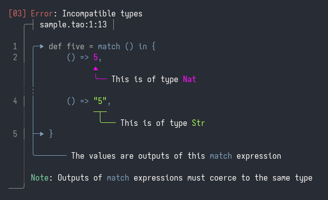

# Ariadne

A fancy compiler diagnostics crate.

## Example

# 

See [`examples/`](examples/) for more examples.

## About

`ariadne` is a sister project of [`chumsky`](https://github.com/zesterer/chumsky/). Neither are dependent on
one-another, but I'm working on both simultaneously and like to think that their features complement each other. If
you're thinking of using `ariadne` to process your compiler's output, why not try using `chumsky` to process its input?

## Features

- Inline and multi-line labels capable of handling arbitrary configurations of spans
- Multi-file errors
- Generic across custom spans and file caches
- A choice of character sets to ensure compatibility
- Coloured labels & highlighting with 256-color support (thanks to [`yansi`](https://github.com/SergioBenitez/yansi))
- Label priority and ordering
- Compact mode for smaller diagnostics
- Correct handling of variable-width characters such as tabs
- A plethora of other options (tab width, label attach points, underlines, etc.)

## Planned Features

- Improved layout planning & space usage
- Non-ANSI terminal support
- More accessibility options (screenreader-friendly mode, textured highlighting as an alternative to color, etc.)

## Credit

Thanks to:

- `@brendanzab` for their beautiful [`codespan`](https://github.com/brendanzab/codespan) crate that inspired me to try
  pushing the envelope of error diagnostics.

- `@estebank` for showing innumerable people just how good compiler diagnostics can be through their work on Rust.
